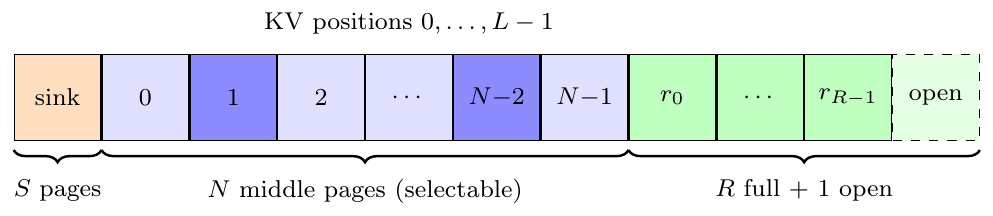
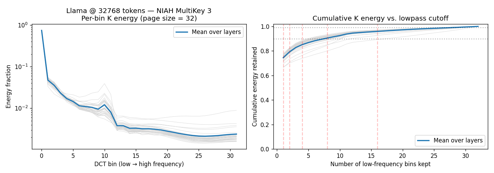
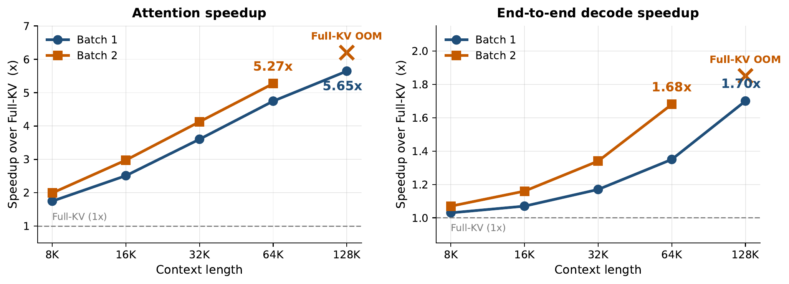
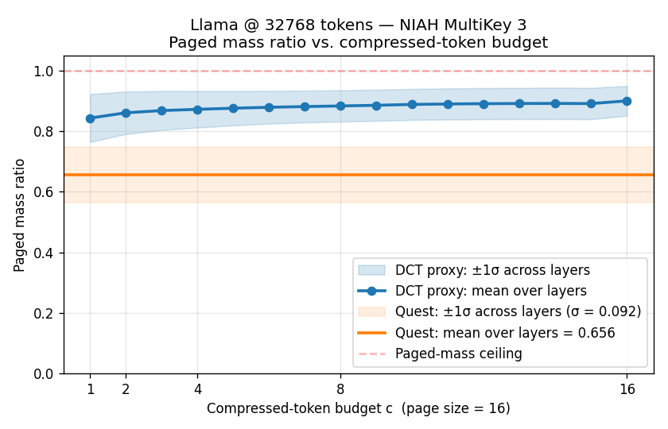

# DCT-Page

**Decode-time sparse page attention for long-context LLMs, with a training-free DCT-lowpass-IDCT proxy for page selection.**

DCT-Page accelerates autoregressive decoding over long contexts by attending to only a small, query-relevant subset of the KV cache. Each fixed-size *page* of past keys/values is summarized by a cheap spectral proxy; the current query scores pages against these proxies, keeps the **top-k** at full precision, and discards (or compresses) the rest. Selection is **training-free** — no auxiliary gates or fine-tuning — and the hot path is implemented as fused Triton kernels.

## Method

At decode time the KV cache is laid out as fixed-size pages, with a small always-kept floor at each end — a `sink` of the first pages and a `recent` window (including the open partial page). Only the middle pages enter selection.

<p align="center">
  
  <br><em>Decode-time KV layout. Sink and recent are always attended; only the N middle pages enter top-k selection (darker cells = selected).</em>
</p>

Prefill runs standard full attention. For each decode step:

1. **Proxy.** Each page (e.g. 32 tokens) is compressed to a compact **DCT-lowpass-IDCT** representation — a low-frequency reconstruction that preserves the directions a query is most likely to attend to. Compression is incremental: only newly completed pages are processed.
2. **Score.** The query attends against the per-page proxies to produce one relevance score per page.
3. **Select.** The **top-k** pages by score are kept at full precision. The always-kept `sink` (first tokens) and `recent` (last window, including the open page) are added unconditionally.
4. **Assemble & attend.** Unselected pages are either
   - **dropped** — removed entirely (fastest), or
   - **compressed** — replaced by a few DCT-lowpass-IDCT tokens per page (quality floor),
   then standard attention runs over the assembled, much shorter KV.

**Why a spectral proxy works.** Viewed as a signal along the sequence axis, decoder-transformer key vectors are overwhelmingly low-frequency: on a RULER trace at 32k context (Llama-3.1-8B), the first four DCT bins capture ≈85% of per-page key energy and eight bins reach ≈90%. A DCT-lowpass reconstruction is therefore a near-lossless proxy for the selection score even after collapsing 32 tokens into a handful.

<p align="center">
  
  <br><em>Per-bin (left) and cumulative (right) DCT energy of key pages, page size 32, per layer (grey) and across-layer mean (blue). The spectrum is strongly low-pass.</em>
</p>

Because selection is a byproduct of a lightweight spectral summary rather than a learned module, DCT-Page applies to off-the-shelf models with a single monkey-patch.

**Default configuration:** `page_size=32`, `top_k=64`, `compress_ratio=0.125` (32→4 proxy tokens), `unselected_mode="drop"`. Below `min_decode_kv_len_for_paging=8192` tokens the patch falls back to dense decode attention. See [config.py](config.py) for the full hyperparameter set.

## Results

Evaluated on **Llama-3.1-8B-Instruct** and **Qwen3-8B**. All sparse methods are matched at a **2,048-token selected budget** (`B·P` with `B=64`, `P=32`). Bold marks the best *sparse* method per column (Full-KV is the dense reference). Higher is better.

### RULER (32k context, per-task accuracy %)

Tasks: S = NIAH-Single, MK = NIAH-MultiKey, MV = MultiValue, MQ = MultiQuery, VT = Variable Tracking, CWE = Common-Word Extraction, FWE = Frequent-Word Extraction, QA = doc QA.

| Model | Method | S1 | S2 | S3 | MK1 | MK2 | MK3 | MV | MQ | VT | CWE | FWE | QA1 | QA2 | **Avg** |
|---|---|--:|--:|--:|--:|--:|--:|--:|--:|--:|--:|--:|--:|--:|--:|
| Llama | Full-KV | 100 | 100 | 100 | 100 | 96 | 100 | 98 | 100 | 98.4 | 48.4 | 93.3 | 72 | 48 | 88.78 |
| Llama | Quest | **100** | **100** | **100** | **100** | **96** | 32 | 97 | 99 | **97.6** | **30.0** | 82.7 | **72** | **48** | 81.10 |
| Llama | InfLLM | **100** | 88 | **100** | 84 | 12 | 8 | 75 | 92 | 44 | 6.4 | **93.3** | 32 | 32 | 58.98 |
| Llama | **DCT-Page** | **100** | **100** | **100** | **100** | **96** | **92** | **100** | **100** | 96 | 28 | **93.3** | **72** | 44 | **86.26** |
| Qwen3 | Full-KV | 100 | 100 | 100 | 96 | 88 | 96 | 95 | 100 | 96 | 86.4 | 93.3 | 56 | 48 | 88.83 |
| Qwen3 | Quest | **100** | **100** | **100** | 92 | **88** | 8 | 90 | 90 | 98.4 | **58.8** | 84 | 48 | **48** | 77.32 |
| Qwen3 | SeerAttn-R | **100** | 84 | 92 | 92 | 40 | 28 | 65 | 88 | 78.4 | 21.6 | **90.7** | 44 | 44 | 66.74 |
| Qwen3 | **DCT-Page** | **100** | **100** | **100** | **96** | **88** | **72** | **97** | **100** | **100** | 46 | 89.3 | **52** | **48** | **83.72** |

### LongBench v1 (per-task score)

F1 for QA, ROUGE-L for summarization, accuracy for in-context learning.

| Model | Method | NarrativeQA | Qasper | MFQA-en | 2WikiMQA | GovReport | TriviaQA | **Avg** |
|---|---|--:|--:|--:|--:|--:|--:|--:|
| Llama | Full-KV | 29.24 | 45.37 | 54.99 | 45.33 | 35.34 | 91.65 | 50.32 |
| Llama | Quest | 28.99 | 43.08 | 51.25 | 44.80 | 29.97 | 91.98 | 48.35 |
| Llama | InfLLM | 25.80 | 43.89 | 49.41 | **46.47** | 34.70 | **92.07** | 48.72 |
| Llama | **DCT-Page** | **29.50** | **45.96** | **55.08** | 44.68 | **35.04** | 91.34 | **50.27** |
| Qwen3 | Full-KV | 24.98 | 48.32 | 51.85 | 43.14 | 33.46 | 90.48 | 48.70 |
| Qwen3 | Quest | **25.47** | 45.74 | 50.74 | 43.15 | 31.20 | 90.30 | 47.77 |
| Qwen3 | SeerAttn-R | 25.30 | 47.13 | 50.85 | **43.33** | 32.54 | 90.31 | 48.24 |
| Qwen3 | **DCT-Page** | 24.93 | **48.01** | **51.93** | 42.89 | **33.54** | **90.48** | **48.63** |

### LongBench v2 (multiple-choice accuracy %)

| Model | Method | Overall | Easy | Hard | Short | Medium | Long |
|---|---|--:|--:|--:|--:|--:|--:|
| Llama | Full-KV | 29.82 | 30.21 | 29.58 | 35.00 | 26.05 | 28.70 |
| Llama | Quest | 18.29 | 22.40 | 15.76 | **38.33** | 10.70 | 0.00 |
| Llama | InfLLM | 26.04 | 25.52 | 26.37 | 31.67 | **26.05** | 16.67 |
| Llama | **DCT-Page** | **30.02** | **33.33** | **27.97** | 34.44 | **26.05** | **30.56** |
| Qwen3 | Full-KV | 29.64 | 31.25 | 28.62 | 28.70 | 26.98 | 33.33 |
| Qwen3 | Quest | 18.09 | 21.88 | 15.76 | 38.33 | 9.77 | 0.93 |
| Qwen3 | SeerAttn-R | **32.60** | **36.46** | 30.23 | **38.89** | **30.23** | **26.85** |
| Qwen3 | **DCT-Page** | 32.01 | 33.33 | **31.19** | **38.89** | 28.84 | **26.85** |

DCT-Page tracks Full-KV within ≈2.5 points of RULER average and is essentially lossless on LongBench, while the page-based baselines (Quest, InfLLM, SeerAttention-R) drop sharply on the harder retrieval tasks (e.g. NIAH-MultiKey-3, LongBench v2 Long).

### Decode throughput

Single A6000, Llama-3.1-8B-Instruct, drop mode. Attention-only speedup reaches **5.65× at 128k** context (batch 1); end-to-end decode (incl. MLP / layer-norm) reaches **1.70× at 128k**. `Full-KV OOM` marks where the dense baseline exhausts the 48 GiB device.

<p align="center">
  
  <br><em>Left: attention-only speedup. Right: end-to-end decode speedup. The relative gain grows with context length because DCT-Page attends a fixed 2,048-token budget regardless of L.</em>
</p>

At `L = 32k` (batch 1) the per-step attention budget decomposes to **1.39 ms** for DCT-Page (0.76 ms scoring/selection bookkeeping + 0.63 ms attention) versus **6.40 ms** for the Full-KV attention kernel it displaces.

## Why it works: attention-mass recall

Top-k selection is only as good as the pages it picks. The **paged attention-mass recall** measures the fraction of the dense softmax mass (over the *selectable* middle pages, excluding the always-kept sink/recent floor) that lands inside the selected set, normalized by the mass-topk oracle ceiling. A scorer reaching recall ≈1 approximates Full-KV regardless of its internal mechanism.

<p align="center">
  
  <br><em>Paged mass-recall vs. proxy length, at a 2,048-token budget (page size 16). DCT-Page's spectral proxy recovers ≈0.85–0.90 of the oracle-achievable mass with only a few proxy tokens per page; Quest's per-channel min/max scorer (no length knob) sits well below at ≈0.66.</em>
</p>

## Quickstart

```bash
pip install -r requirements.txt
# Core env (DCT_Page conda): torch 2.11.0, transformers 5.5.4, triton 3.6.0
```

Monkey-patch **before** loading the model:

```python
import torch
from transformers import AutoModelForCausalLM
from dct_page_attention import replace_llama_attn   # or replace_qwen3_attn

replace_llama_attn(
    page_size=32,
    top_k=64,
    compress_ratio=0.125,
    unselected_mode="drop",   # or "compressed"
    use_triton=True,
)

model = AutoModelForCausalLM.from_pretrained(
    "meta-llama/Llama-3.1-8B-Instruct",
    torch_dtype=torch.bfloat16,
    device_map="auto",
    attn_implementation="sdpa",
)
```

Reproduce a benchmark point (RULER @ 32k, Qwen3-8B):

```bash
# DCT-Page
python eval_ruler.py --mode page_attention --base_model Qwen/Qwen3-8B \
  --seq_lengths 32768 --page_size 32 --top_k 64 --unselected_mode drop \
  --output_dir results/ruler --run_name dctpage

# Dense baseline
python eval_ruler.py --mode baseline --base_model Qwen/Qwen3-8B \
  --seq_lengths 32768 --output_dir results/ruler --run_name baseline
```

Full sweeps over models and budgets live in [experiments/](experiments/) (`run_*.sh`).

## Baselines

Side-by-side implementations under [baselines/](baselines/), selected via `--mode` in the eval scripts:

| Method | Mechanism | Models |
|---|---|---|
| **SeerAttention-R** | learned gate-based decode sparsity | Llama 3.x, Qwen2/3 |
| **Multipole** | hierarchical k-means page clustering | Llama 3.x, Qwen2/3 |
| **Quest** | per-page min/max key metadata + CUDA kernels | Llama 2/3.x, Mistral, Qwen3 |
| **InfLLM** | retrieval-based block attention (vendored) | Llama 3.x |
| **DuoAttention** | streaming/retrieval head split | Llama 3.x (separate env) |

Setup notes (extra envs, kernel builds, checkpoints) are in [CLAUDE.md](CLAUDE.md#baselines).

## Repository

- **Method & kernels:** [config.py](config.py), [dct_page_attention.py](dct_page_attention.py), [triton_kernels.py](triton_kernels.py)
- **Evaluation:** `eval_ruler.py`, `eval_longbench_v1.py`, `eval_longbench_v2.py`, `eval_aime25.py`, `eval_gpqa.py`, `eval_math500.py`
- **Diagnostics:** [observations/](observations/) — oracle upper bounds, attention-mass recall, scoring-method comparisons
- **Speed/profiling:** [speed/](speed/) — throughput benchmark and per-stage decode profiler
- **Sweeps & data:** [experiments/](experiments/), [benchmark/](benchmark/)

See **[CLAUDE.md](CLAUDE.md)** for the full file-by-file map, architecture details, the complete command catalog, and per-baseline setup.

## Notes

- The only active score proxy is **DCT-lowpass-IDCT**; earlier Haar / Walsh-Hadamard / direct-spectral variants have been removed.
- `drop` mode targets speed; `compressed` mode is for accuracy studies (sets a quality floor by retaining a compressed view of unselected pages).
- Benchmark data under `benchmark/data/` is gitignored (~136 MB) and regenerates on demand (RULER synthetic via `--prepare`; LongBench auto-downloaded from Hugging Face).
- LongBench v1 semantics follow the FastKV adjustments (prompt formatting, no-chat tasks, metric computation).
